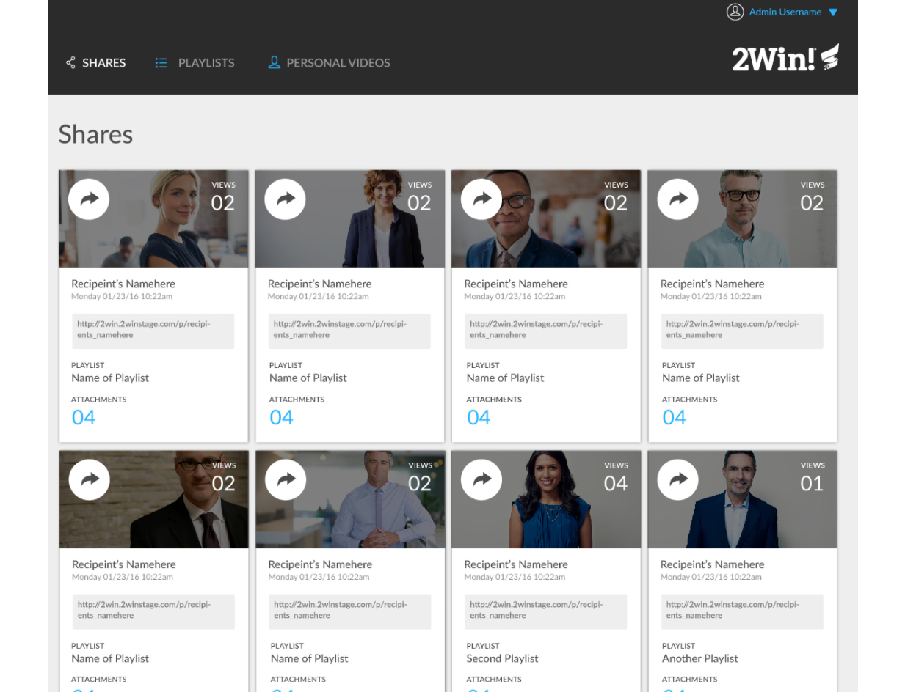

# Git-A-Date

## Table of Contents
* [Description](#description)
* [Installation](#installation)
* [Walkthrough](#walkthrough)
* [Authors](#authors)
* [Technologies](#technologies)

## Description

#### Original Comp to Match

 

#### Final: Desktop View

#### Final: Tablet View

#### Final: Mobile View

### Notable Features
* Responsively designed to ensure both desktop and mobile compatibility

### Learning Goals

The project spec & rubric can be found [here](https://frontend.turing.io/projects/module-1/ideabox-group.html)

### Project Links
* [GitHub Repo]()

* [GitHub Page]()

## Installation
1. Clone this repo via `git clone https://github.com/EllieAzaveda/Git-A-Date.git`
2. Access cloned directory
3. Run `index.html`

## Walkthrough

1.

2.

3.

## Authors
<table>
    <tr>
        <td> Ellie Azaveda <a href="https://github.com/EllieAzaveda">GH</td>
    </tr>
    </tr>
        <td></td>
    </tr>
</table>

## Technologies
<table>
    <tr>
        <td>Functionality</td>
        <td>Structure</td>
        <td>Styling</td>
    </tr>
    </tr>
        <td></td>
        <td></td>
        <td></td>
    </tr>
</table>
